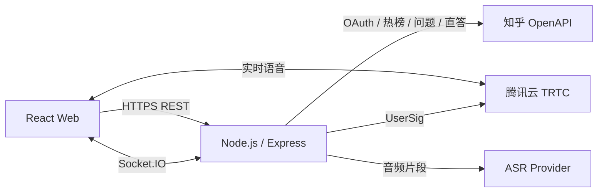

# 知了当前版本技术架构与模块边界

本文件服务于 [`current-version-scope.md`](./current-version-scope.md) 所列的当前开发范围。完整产品需求与后续能力以 [`知了语音辩论产品PRD_MVP.md`](./知了语音辩论产品PRD_MVP.md) 为准。

## 1. 架构目标

本项目采用“单仓库、单服务部署、媒体与状态分离”的架构：

- React Web 负责页面、设备权限和 TRTC 客户端。
- Node.js 服务负责身份、房间规则、知乎 OpenAPI、TRTC 凭证、转写与总结。
- TRTC 只承载实时语音。
- Socket.IO 只承载房间状态、公屏、麦位、队列和发言锁。
- MVP 使用内存状态，不写数据库；数据访问必须经过 Store 接口，为后续 Redis/数据库迁移留出边界。
- 产物优先部署到 AI Works；同时保持为标准 Node HTTP 服务，便于迁移到普通服务器。

## 2. 系统关系

## 3. 技术选型

| 范围       | 选型                        | 说明                                   |
| ---------- | --------------------------- | -------------------------------------- |
| Web        | React、Vite、TypeScript     | PC 优先，随后响应式适配移动端          |
| 路由       | React Router                | 大厅、创建房间、房间、OAuth 回调       |
| 客户端状态 | Zustand                     | 登录态、房间快照、RTC 状态和 UI 状态   |
| 样式       | Tailwind CSS、CSS Variables | 快速实现响应式界面与主题变量           |
| HTTP 服务  | Node.js、Express            | 简单、通用，适合 AI Works 与普通服务器 |
| 实时状态   | Socket.IO                   | 房间广播、ACK、断线重连和事件命名空间  |
| 实时语音   | TRTC Web SDK                | 浏览器麦克风采集、发布及远端音频播放   |
| 输入校验   | Zod                         | REST 与 Socket.IO 共用数据契约         |
| 测试       | Vitest、Playwright          | 领域规则单测与多浏览器链路测试         |

依赖版本在搭建工程时锁定；在读取 AI Works 部署 Skill 的运行时要求前，不提前固定 Node 主版本。

## 4. 代码模块

### 4.1 Web 模块

| 模块         | 职责                                   | 不负责                       |
| ------------ | -------------------------------------- | ---------------------------- |
| `auth`       | 游客会话、知乎登录跳转、OAuth 回跳恢复 | 保存 OAuth Secret            |
| `lobby`      | 热榜房与自定义房列表、加载和降级状态   | 直接调用知乎 OpenAPI         |
| `topic`      | 展示知乎问题和背景材料                 | 服务端 Token 管理            |
| `room`       | 房间快照、成员状态、离开与重连 UI      | 裁决发言锁                   |
| `seats`      | 6 个麦位、排队、上下麦交互             | 自行修改权威麦位状态         |
| `speaker`    | 发言按钮、倒计时、冷却展示             | 本地决定锁归属               |
| `rtc`        | TRTC 初始化、进退房、采集和播放        | 生成 UserSig                 |
| `chat`       | 公屏、历史消息、点赞、打赏动效         | 生成服务端消息 ID 或计算余额 |
| `account`    | 展示本人知豆余额、经验和等级           | 向其他用户暴露余额或自行记账 |
| `debate-log` | 发言记录、转写状态和 AI 总结           | 直接持有模型密钥             |

### 4.2 Server 模块

| 模块               | 职责                                                                     |
| ------------------ | ------------------------------------------------------------------------ |
| `auth`             | 游客会话、知乎 OAuth、加密 Cookie、权限判断                              |
| `zhihu-gateway`    | 热榜、问题、回答和直答接口适配、限流、缓存与官方房同步                   |
| `room-domain`      | 房间生命周期、成员与房间快照                                             |
| `seat-domain`      | 6 席位、等待队列、上下麦规则                                             |
| `speaker-lock`     | 唯一发言锁、120 秒超时、60 秒冷却                                        |
| `realtime-gateway` | Socket.IO 鉴权、命令 ACK、房间广播和重连快照                             |
| `account-domain`   | 等级阈值、知豆余额、点赞经验和打赏事务规则                               |
| `rtc-credential`   | 服务端生成短期 TRTC UserSig                                              |
| `transcript`       | 接收单次发言音频、调用腾讯云极速版 ASR、广播转写状态                     |
| `summary`          | 按日志版本调用直答 API、去重和缓存结果                                   |
| `stores`           | Room、Message、Account、Reward、Transcript、Summary 的存取接口及内存实现 |

## 5. 权限矩阵

| 能力                           | 游客 | 知乎登录用户 |
| ------------------------------ | :--: | :----------: |
| 浏览大厅与话题                 |  ✓   |      ✓       |
| 进入房间、旁听                 |  ✓   |      ✓       |
| 查看公屏和辩论日志             |  ✓   |      ✓       |
| 发送公屏、点赞、打赏当前发言者 |  ✓   |      ✓       |
| 创建自定义房间                 |  —   |      ✓       |
| 申请上麦、进入排队             |  —   |      ✓       |
| 获取发言锁、发布音频           |  —   |      ✓       |
| 上传本人发言音频               |  —   |      ✓       |

所有权限由服务端再次校验，前端隐藏按钮不能代替鉴权。

## 6. 核心领域模型

- `UserSession`：游客或知乎用户的会话身份。
- `UserAccount`：仅本人可见的知豆余额、经验、等级与下一等级门槛。
- `Topic`：知乎热榜话题或用户手动标题；当前版本不开放粘贴知乎问题链接创建房间。
- `Room`：话题、可见性、成员、状态和单调递增版本号。
- `Seat`：固定 1～6 号麦位及占用者。
- `SeatQueue`：麦满后的先进先出队列。
- `SpeakerLock`：唯一持有者、开始时间、到期时间。
- `Cooldown`：用户本次发言后的冷却截止时间。
- `ChatMessage`：公屏消息及系统消息。
- `RewardTransfer`：打赏者、当前发言者、档位和幂等键组成的知豆转账。
- `SpeechTurn`：一次获得发言锁到释放锁之间的发言段。
- `Transcript`：一次发言经 ASR 生成的文本和处理状态。
- `DebateSummary`：基于某个房间日志版本生成的结构化总结。

## 7. 一致性规则

1. 发言锁只能由服务端授予；同一房间最多存在一个有效锁。
2. 用户必须在麦位上、已登录、未冷却，才能申请发言锁。
3. 锁在主动闭麦、离开麦位、断线超时或 120 秒到期时释放。
4. 释放锁后，原持有者进入 60 秒冷却，其他麦上用户不受影响。
5. Socket.IO 每个命令必须带 `requestId`，服务端返回 ACK，避免重试造成重复操作。
6. 房间状态包含递增 `version`；客户端发现版本断层时请求完整快照。
7. 客户端只能根据服务端事件开始发布音频，不能以本地按钮状态作为授权。
8. 打赏对象由当前有效发言锁决定；客户端不能指定任意收款人，也不能打赏自己。
9. 知豆扣款、到账和被打赏者经验增加必须作为一个原子操作执行；同一 `requestId` 重试不得重复扣款。
10. 等级和称号可以随房间用户信息公开，知豆余额只能经会话 REST 响应或本人 Socket 连接返回。

## 8. MVP 状态与迁移边界

MVP 的房间、公屏、账户、打赏、转写和总结存放在 Node 进程内存中：

- 房间最后一人离开后进入默认 60 秒回收宽限期，重进取消回收，超时仍为空则关闭并移除。
- 每房只保留有限数量的公屏和发言记录。
- 服务重启后临时房间允许丢失。
- 服务重启后演示账户的知豆和经验也会重置；接入持久化数据库后再承诺跨重启保留。
- 热榜请求使用 TTL 缓存，并提供静态预置话题兜底。

所有状态通过 Store 接口访问。若 AI Works 的多实例或缩容行为影响 Socket.IO，再将 Store 与锁实现替换为 Redis，或将同一服务部署到单台普通服务器。

## 9. 安全边界

- 知乎 OAuth Secret、TRTC SecretKey、ASR 密钥只存在于服务端环境变量。
- OAuth 会话使用 `HttpOnly`、`Secure`、`SameSite=Lax` Cookie。
- 若知乎 OAuth 支持回传 `state`，必须校验；同时使用签名的一次性 OAuth 尝试 Cookie 绑定发起浏览器，并限制 `returnTo` 只能是站内路径。
- TRTC UserSig 使用短有效期，客户端不得接触 SecretKey。
- 首次上麦前提示语音将用于转写和 AI 总结；MVP 不保存原始录音。
- 公屏、点赞、打赏、创建房间和总结接口均设置频率限制。
- 日志与错误响应不得记录 Token、Cookie、Secret 或完整音频内容。

## 10. 部署约定

- 根目录提供统一的 `build` 和 `start` 命令。
- Web 构建产物由 Express 静态托管，HTTP 与 Socket.IO 使用同一个端口。
- 服务监听 `process.env.PORT`，不写死域名和端口。
- 健康检查使用 `GET /api/v1/health`。
- 所有外部服务地址与密钥通过环境变量注入。
- 线上必须使用 HTTPS，保证浏览器允许麦克风采集。
