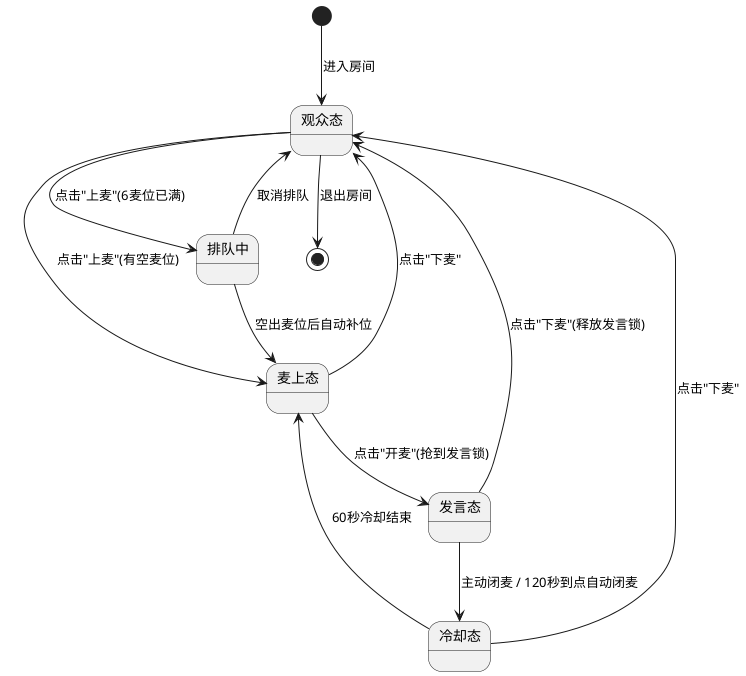
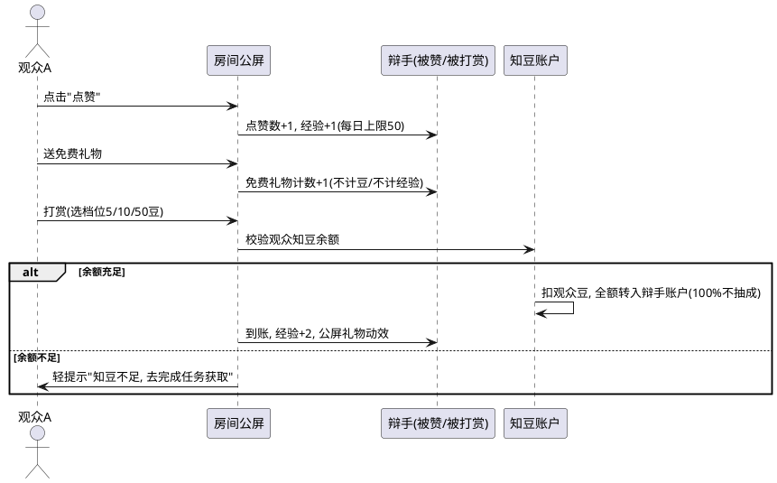
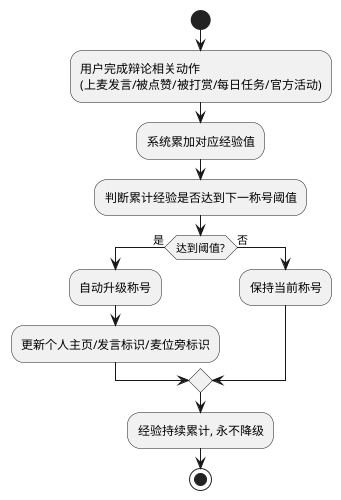

# 知了 · 语音辩论产品 PRD（MVP · 最终版）

> 文档版本：v1.5（最终版，已与业务方逐项对齐，含 UI 指导、技术底线与验收标准）
> 交付形态：网页版（Web，响应式，先做网页版，再进行移动端适配），最终产出评委可直接体验的网址
> 开发周期：2 天
> 范围原则：只做「能跑通核心闭环」的最小功能。本期不做项统一标注「本期不做」；可交给开发裁量的技术选型项标注「dev 决定」，并给出兜底红线。

---

## 1. 项目背景

- **需求简介**：做一个以「语音上麦辩论」为核心、以弹幕/公屏为辅的实时语音房间产品，让用户围绕知乎热点或自定义主题即兴开麦辩论，通过知豆（辩论币）与辩手称号体系完成激励闭环。
- **业务诉求**：知乎有大量热点话题但缺乏「实时语音观点交锋」的轻量互动场景；用户需要一个低门槛、有对抗感、有成长感的表达场。本期目标是 2 天内上线一个能跑通的网页 Demo，最终给评委体验，验证「进房—上麦—发言—打赏—升级」主链路。
- **MVP 边界（本期不做）**：
  - 内容审核：不做，仅保留「举报」入口做人工兜底。
  - 商城兑换：做简版（虚拟 mock 兑换码、实物仅占位展示），不做物流/库存/订单中心（见 3.6.3）。
  - 胜负机制：不做，删去「辩论胜场」经验来源，发言质量交给打赏市场化激励。
  - 支付/提现：不做，知豆为站内虚拟积分，不可兑换真钱。
  - 语音技术细节：实时语音不自研，使用现成实时语音服务承载（详见 7.1）。

## 2. 业务流程简述

评委点开链接 → 以游客身份零门槛进入首页 → 看到「官方房（知乎热榜）+ 私人房」列表 → 点进房间以观众身份进入 → 看公屏弹幕、点赞、送免费礼物、打赏 → 点「上麦」占位 → 点「开麦」抢到发言锁开始发言（单次最多 120 秒）→ 闭麦后进入 60 秒冷却 → 被点赞/被打赏获得经验 → 经验累计自动升级称号 → 称号展示在个人主页、发言标识、麦位旁。创建私人房时自定义主题、选择「邀请制/全部人可见」，凭邀请链接或房间号邀请知友。晚来者打开「辩论日志」看刘看山整理的历史发言补课。

## 3. 详细功能需求说明

### 3.1 登录与游客身份
- **位置**：全局前置，进入首页、进房、创建房间时的兜底流程。
- **目标**：零门槛进入，评委点开链接即可体验，不设任何登录/授权/验证码障碍。

#### 3.1.1 界面元素与展示规则
- 首次需要身份时（进房/创建房间），弹出轻量「起个昵称」入口：预填可辨识随机名（如「辩手 3 号」），可直接修改，也可跳过直接进入。
- 个人主页、发言标识、麦位旁展示当前昵称。

#### 3.1.2 交互逻辑与状态流转
- **游客即进**：无需注册/登录，系统自动分配一个本设备专属的游客身份。
- **昵称**：预填随机可辨识名，可随手改；不填则用默认随机名。
- **身份记忆**：同一设备刷新后，昵称、知豆、经验、称号均保持不变。

#### 3.1.3 异常与系统边界
- 不同设备/浏览器进入，视为不同游客，互不串号（MVP 接受，不提供跨设备找回）。
- 知乎授权登录、手机号登录均留 2.0（见 7.3）。

### 3.2 房间大厅（列表页）
- **位置**：首页，登录后默认落地页。
- **目标**：让评委 3 秒内找到想进的房间并完成「进房」这一个核心动作。

#### 3.2.1 界面元素与展示规则
- **顶部区**：静态文案「知了」；右上角「个人头像 + 当前称号徽章」。
- **标签页**：静态文案「官方房」「私人房」两个标签。
- **房间卡片**：
  - 动态文案：房间主题（来源：房间数据）、当前麦上人数、当前观看人数、房主昵称。
  - 官方房专属：展示「热度标签」（来源：知乎热榜热度分值，按热度倒序排列）。
  - 溢出规则：主题单行展示，超 16 字截断尾部加「...」。
  - 空态兜底：私人房标签无房间时，展示空态插画 + 文案「暂无房间，点右下角创建一个」；官方房拉取失败时，降级展示预置话题（见 3.9）。
- **右下角悬浮按钮**：静态文案「+ 创建房间」。

#### 3.2.2 交互逻辑与状态流转
- **进房（生命周期六步法）**：
  1. 初始化条件：已进入（游客身份）。
  2. 默认态：房间卡片整卡可点击。
  3. 触发指令：单击卡片。
  4. 执行中过程态：卡片给出即时点击反馈，进入房间加载页（展示主题 + 加载提示）。
  5. 执行异常：房间已关闭/满员 → 返回列表，顶部红色轻提示「房间已关闭」或「房间已满」。
  6. 执行成功：进入房间页（见 3.3）。
- **刷新**：下拉刷新；断网展示「加载失败，点击重试」。

#### 3.2.3 异常与系统边界
- **环境降级**：弱网下卡片动效降级为纯文本；列表数据本地缓存。
- **登录态缺失**：未起昵称时点击进房/创建，先走 3.1 昵称流程，仍可正常进入。

### 3.3 辩论房间（核心页）
- **位置**：从大厅点卡片进入。
- **目标**：承载「听—评—辩—打赏」全链路，是产品核心。**上麦机制：自由上麦，先到先得，满麦排队，全程无任何用户拥有高于他人的发言权力。**

#### 3.3.1 界面元素与展示规则
- **顶部信息条**：动态文案「房间主题（超 16 字截断）+ 在线人数 + 房主昵称」；左上「←」返回。
- **麦位区（6 个麦位）**：
  - 每个麦位展示：头像、昵称、当前称号徽章、发言状态（说话时需有醒目的视觉标识，让「谁在说话」一眼可见）。
  - 空麦位：灰色占位头像 + 文案「空麦位」。
  - 本人麦位角标「我」。
- **公屏/弹幕区**：
  - 动态文案：昵称 + 消息；打赏/礼物以系统消息插入（如「[某用户] 打赏了 [档位] 知豆」）。
  - 加载方式：上拉加载历史（每页 30 条），新消息自动滚底。
  - 溢出规则：单条超 40 字截断加「...」，点击展开。
  - 空态兜底：「还没有人说话，快来暖场吧」。
- **底部操作栏（观众态）**：图标按钮「点赞」「礼物」「打赏」+ 主按钮「上麦」。
- **底部操作栏（麦上态）**：主按钮「开麦」（占位后）+「下麦」，保留「点赞/礼物/打赏」。
- **底部操作栏（冷却态）**：「开麦」按钮置灰，显示倒计时「冷却中 XXs」。

#### 3.3.2 交互逻辑与状态流转（发言锁机制，见状态机图 diagram1）
- **上麦**：点击「上麦」，有空麦位直接占位进入麦上态；6 麦位已满则进入排队，空出麦位后自动补位（可随时取消排队）。
- **抢锁开麦**：麦上用户点「开麦」，先点先得发言锁。别人持锁时，其余麦上用户的「开麦」按钮置灰并显示「[某某] 正在发言」。
- **单次发言限时**：开麦后倒计时「剩余 XX:XX」，最后 10 秒醒目提醒 + 轻提示「时间快到了」；到 120 秒自动闭麦。
- **闭麦与冷却**：主动闭麦或到点自动闭麦，立即释放发言锁，本人进入 60 秒冷却期（开麦按钮置灰「冷却中 XXs」）；其他麦上用户不受冷却影响，锁一释放即可抢。
- **下麦**：麦上/发言中/冷却中均可主动下麦，回到观众态；发言中下麦同时释放发言锁。
- **发言锁边界**：观众始终只能听 + 弹幕文字互动，不参与抢锁。

#### 3.3.3 异常与系统边界
- **麦克风权限**：首次开麦弹窗「需要麦克风权限才能发言」，提供「去设置」。
- **房间生命周期**：房间系统托管，有人则房间在；最后一人退出后自动回收。房主退出不触发解散、不触发转交（房主无特权）。
- **系统级中断**：刷新/关闭页面即视为退房，重进后回到观众态，麦位与发言锁不保留。

### 3.4 创建房间（私人房）
- **位置**：大厅右下角「+ 创建房间」。
- **目标**：两步创建一个自定义主题的私人房，核心价值是「圈定人群」（只想和某几个知友辩论）。

#### 3.4.1 界面元素与校验规范（表单）
- **房间主题（文本输入，必填）**：自动聚焦；实时校验；1~30 字，超长不可输入，空值提交轻提示「请输入房间主题」。
- **可见范围（单选，必选，默认「邀请制」）**：
  - 「邀请制」：仅凭邀请链接/房间号进入（推荐，贴合「和几个知友辩」）。
  - 「全部人可见」：公开，任何人可进。
- **提交按钮**：静态文案「创建并进入」。

#### 3.4.2 交互逻辑与状态流转
1. 触发：点击「创建并进入」。
2. 前置校验：主题非空且 ≤30 字。
3. 异常：校验失败阻断并轻提示。
4. 成功：创建房间并自动进入（创建者即房主，但房主＝发起人，无任何高于他人的发言权力），生成邀请链接/房间号，可在房内复制分享。

#### 3.4.3 异常与系统边界
- 邀请链接/房间号失效（房间已回收）→ 打开提示「房间已结束」。
- 本期不做「好友可见」档（依赖知乎关注关系，留 2.0，见 7.3）。

### 3.5 互动体系（点赞 / 免费礼物 / 打赏）
- **位置**：房间底部操作栏。
- **目标**：用市场化信号（点赞、打赏）表达认同，构成「说得好→被打赏→攒经验升级」的激励闭环。

#### 3.5.1 界面元素与展示规则
- 三类互动合并为：点赞、免费礼物、打赏（原「知豆礼物」与「打赏」合并为一件事，避免重复开发）。
- 打赏档位：5 / 10 / 50 豆，点击即送出。

#### 3.5.2 交互逻辑与状态流转（见时序图 diagram2）
- **点赞（免费）**：点击有即时反馈，点赞数 +1，被赞者经验 +1（每日上限 50）；失败回滚并轻提示「操作失败，请重试」。
- **免费礼物（免费）**：纯视觉表达，不计知豆、不计经验，用于低门槛暖场。
- **打赏（知豆）**：选档位 → 点击赠送 → 校验余额。余额充足：扣除打赏者知豆，**100% 全额转入被打赏者账户（平台不抽成）**，被打赏者经验 +2，公屏插入礼物动效；余额不足：轻提示「知豆不足，去完成任务获取」。

### 3.6 知豆与任务
- **位置**：个人主页「知豆」入口；房间内打赏面板。
- **目标**：保证「打赏」有真实的存量与来源，形成最小经济闭环。

#### 3.6.1 界面元素与展示规则
- 个人主页展示知豆余额（纯文本数字）。
- 每日任务区展示三个任务卡片：任务名 + 奖励 + 状态（未完成/已领取）。

#### 3.6.2 交互逻辑与状态流转
- **新手豆**：新游客默认拥有 100 知豆（冷启动）。
- **每日任务（合计约 50 豆/天）**：
  - 每日首次进房：+10。
  - 累计发言满 5 分钟：+20。
  - 点赞 5 次：+20。
- **流通**：知豆可花（打赏）可赚（被打赏），但不可提现、不可兑换真钱。
- **商城**：知豆可兑换虚拟物品与实物，入口见 3.6.3。

#### 3.6.3 商城兑换（简版）
- **位置**：个人主页「知豆」入口 → 商城。
- **目标**：给知豆一个「花出去」的出口，补齐经济闭环。
1. **商品列表**：
   - 虚拟物品：盐选券、虚拟会员、知识博客（兑换后 mock 生成一个兑换码）。
   - 实物周边：IP 周边（占位图展示）。
   - 每件商品展示：名称、占位图、所需知豆数。
2. **兑换流程（虚拟物品）**：
   - 触发指令：点击「兑换」。
   - 前置校验：知豆余额充足。
   - 执行异常：余额不足 → 轻提示「知豆不足，去完成任务获取」，不扣豆。
   - 执行成功：扣除知豆，弹窗展示兑换码（mock），知豆余额同步减少。
3. **兑换流程（实物周边）**：
   - 执行成功：扣除知豆，弹窗提示「兑换成功，敬请期待发货」。
4. **本期不做**：购物车、订单中心、兑换记录、收货地址、物流、库存。

### 3.7 个人主页与称号
- **位置**：大厅头像 → 个人主页。
- **目标**：展示当前称号、累计经验、知豆余额，承载成长感。

#### 3.7.1 界面元素与展示规则
- 头像、昵称、当前称号徽章、累计经验数值、知豆余额。
- 升级进度条：当前等级到下一等级经验进度（如 320/500）。
- 完整展示 6 级称号对照表（见下表）。

| 等级 | 称号 | 累计经验 | 主页/权益 |
| :--- | :--- | :--- | :--- |
| 1 | 蛰伏 | 0 | 基础称号标识 |
| 2 | 破土 | 500 | 发言时昵称高亮 |
| 3 | 蜕壳 | 2000 | 专属称号徽章 |
| 4 | 振翅 | 5000 | 专属头像框 |
| 5 | 鸣夏 | 12000 | 专属进场动效，官方认证候选 |
| 6 | 知秋 | 30000 | 官方认证，专属称号展示 |

#### 3.7.2 交互逻辑与状态流转（经验与称号，见流程图 diagram3）
- **经验规则（只升级称号，不可消费）**：
  - 上麦发言：1 经验/分钟（不足 1 分钟按比例计）。
  - 被点赞：+1/次，每日上限 50。
  - 被打赏：+2/次。
  - 每日任务：+10~30。
  - 官方活动：额外经验（本期无活动，字段预留）。
- **升级规则**：经验累计达阈值自动升级、不降级；升级瞬间弹窗「恭喜升级为 [称号]」+ 称号徽章，点「知道了」关闭。
- **展示位置**：个人主页、发言标识（昵称旁徽章）、麦位旁。

### 3.8 AI 刘看山（辩论日志）
- **位置**：房间内「辩论日志」入口，手动触发。
- **目标**：让后来进房的人快速补上「前面的人说了什么」，是刘看山 IP 的本期唯一落地能力。

#### 3.8.1 产品层规则（写死，dev 不可改）
- 房间内有「辩论日志」入口，手动触发。
- 日志按时间列出历史发言记录：昵称 + 时间 + 内容（一句话观点/摘要）。
- 刘看山 IP 作为「整理者」出现（头像 + 「看山帮你整理了前面的发言」）。
- 呈现方式：刘看山头像 + 公屏/浮层气泡文字，纯文字，不做语音朗读（TTS 留 2.0）。

#### 3.8.2 技术层规则（dev 决定，含兜底红线）
- 发言文字内容的「原料来源」为开放项，dev 可在两条间选，也可混合：
  - 方案 A：接语音转写（ASR），自动生成；
  - 方案 B：闭麦时弹框让发言者留一句摘要（可跳过）。
- 总结生成推荐用知乎「直答 Agent」接口（基于知乎内容生成有据可依的精炼回答），替代自接大模型，需 dev 验证其对「总结」场景的适配性。
- **兜底红线**：无论选哪条，辩论日志功能必须上线；若 ASR 评估不可行或翻车，一律降级为「方案 B 发言者留摘要」，不得因 ASR 失败而砍掉日志。

### 3.9 官方房房源（知乎热榜接入）
- **位置**：大厅「官方房」标签。
- **目标**：用知乎热榜接口生成「有活数据」的官方房，并让辩论有知乎优质内容垫底。

#### 3.9.1 界面元素与展示规则
- 官方房卡片展示：问题标题（房间主题）+ 热度标签（来源：热度分值，按热度倒序）+ 观看人数。
- 房间内展示「背景材料」区：知乎热榜返回的「优质回答摘要」，供辩手发言前参考。

#### 3.9.2 交互逻辑与状态流转
- 拉取知乎热榜生成官方房列表，热度分值做排序。
- **缓存与降级（写死）**：热榜接口单用户上限 100 次/天，必须应用层缓存（启动拉一次或每 30 分钟刷新），避免重复请求；接口失败时降级为预置话题，保证门面内容不空。

## 4. 流程与状态图表 (PlantUML)

### 4.1 麦位与发言锁状态机

### 4.2 点赞/礼物/打赏时序

### 4.3 经验与称号升级流程

## 5. 附录 (Appendix)

### 5.1 麦位与发言锁状态机（源码）

### 5.2 点赞/礼物/打赏时序（源码）

### 5.3 经验与称号升级流程（源码）

## 6. 图片管理

- 图片位于本 PRD 文件同目录 `plantuml-images/` 文件夹：4.1 → diagram1.png、4.2 → diagram2.png、4.3 → diagram3.png。
- 附录 5.x 保留全部 PlantUML 源码，便于后续修改并重新生成。

---

## 7. 非功能约束、UI 指导与后续规划

### 7.1 技术底线与原则（只定底线与原则，不指定实现选型）
1. **实时语音不自研**：使用现成实时语音服务承载，优先用免费/试用额度（两天 Demo 用量极小）。
2. **声音与状态分离**：声音走语音服务；房间状态（谁开麦、打赏、弹幕等）走实时同步通道。两条路各司其职。
3. **发言锁唯一性（硬底线）**：同一房间同一时刻仅允许一人发声，不得因多人同时触发「开麦」而产生两个发声源。具体裁决机制由技术实现，但「唯一」是必须保证的产品规则。
4. **知豆账务一致性（硬底线）**：打赏扣款与到账必须一致，不得出现「扣了豆没到账」或「重复到账」。
5. **接口调用约束**：知乎热榜、直答 Agent 等接口有日调用上限（100/5000 次不等），必须应用层缓存 + 调用失败降级，禁止实时高频请求。
6. **辩论日志兜底红线**：无论采用何种语音转文字方案，辩论日志功能必须上线；若语音转写不可行，一律降级为「发言者留摘要」，不得因转写失败砍掉日志。
7. **交付形态**：两天内交付一个评委可访问的网址。

### 7.2 UI 设计指导（只定原则，不指定视觉方案）
1. **整体调性**：以知乎的克制为底（书卷气、理性），仅在「辩论进行时」的局部（谁在发言、发言倒计时）用更热烈的点缀，营造「平时安静、开麦即燃」的对比。
2. **信息优先级（房间页）**：当前发言者 > 我能否说话（发言锁/倒计时/冷却）> 公屏文字流 > 打赏/礼物入口。「谁在说话」永远最显眼。
3. **两层公屏**：普通文字互动采用弹幕式飘屏（可开关、可调密度），负责热闹；打赏、礼物、称号升级等系统消息固定高亮展示、不随飘屏消失，负责高光与不被错过。
4. **核心状态可读性**：以下状态必须让用户一眼看懂——谁在说话、发言锁归属、倒计时、冷却中、排队中、称号徽章。具体视觉形式由 UI 同学发挥。
5. **激励的爽感**：打赏动效、称号递进要有即时、正面的反馈，激励用户持续发言。

### 7.3 后续规划（2.0，本期不投入开发）
- **关注流接口 → 「好友可见 / 邀请知友」**：当前私人房用邀请链接，未来可基于知乎关注关系做「好友可见」与「邀请指定知友」，需接知乎授权登录与关注列表。
- **搜索接口（知乎 + 全网）→ 「论据检索 / 刘看山辅助辩论」**：辩手上麦前可检索知乎/全网论据。
- **账号体系**：知乎授权登录、手机号登录，实现真实身份与跨设备数据同步。
- **商城增强**：实物履约（收货地址/物流/库存）、订单中心、兑换记录。
- **刘看山增强**：知识检索、辅助辩论、语音朗读（TTS）、自动触发总结。

---

## 8. 验收标准（Acceptance Criteria）

> 均为「必须」项，可逐条以「是/否」判定。全部通过视为交付完成。

### 8.1 登录与游客身份
- [ ] 评委点开链接，无需登录/授权/验证码即可进入首页。
- [ ] 首次进房/创建房间时弹出轻量昵称入口，预填可辨识随机名，可改可跳过。
- [ ] 同一设备刷新后，昵称、知豆、经验、称号均保持不变。
- [ ] 不同设备/浏览器进入，视为不同游客，互不串号。

### 8.2 房间大厅
- [ ] 首页展示「官方房」「私人房」两个标签，可切换。
- [ ] 官方房卡片展示问题标题 + 热度标签，按热度倒序排列。
- [ ] 热榜接口失败时，自动降级为预置话题，页面不空白。
- [ ] 点击卡片进入对应房间；房间满员时提示「房间已满」。

### 8.3 上麦与发言锁
- [ ] 点「上麦」占用空麦位；6 麦位满后进入排队，空出后自动补位。
- [ ] 同一时刻最多一人发声；第二人点「开麦」被挡。
- [ ] 两人几乎同时点「开麦」，最终只有一人进入发言态，不出现两人同声。
- [ ] 持锁者闭麦/下麦后，发言锁立即释放，他人可抢。
- [ ] 闭麦后本人进入 60 秒冷却，冷却期「开麦」不可点，倒计时结束恢复。
- [ ] 单次发言满 120 秒自动闭麦；最后 10 秒有醒目提醒。
- [ ] 观众（未上麦）全程无法发声，只能文字互动。
- [ ] 说话者麦位有醒目的视觉标识，能一眼看出谁在说话。

### 8.4 公屏与互动
- [ ] 普通文字以弹幕形式即时滚动展示，房间内多人可见。
- [ ] 打赏/礼物/升级等系统消息固定高亮展示，不随弹幕飘走。
- [ ] 点赞有即时反馈，被赞者点赞数 +1；失败时回滚并轻提示。
- [ ] 被点赞经验 +1，单用户每日上限 50。

### 8.5 知豆消费（打赏与商城）
- [ ] 新游客默认拥有 100 知豆。
- [ ] 打赏档位 5/10/50，点击后校验余额。
- [ ] 余额充足：扣打赏者豆，被打赏者 100% 全额到账、经验 +2，公屏出现礼物动效。
- [ ] 余额不足：轻提示「知豆不足」，不产生扣款。
- [ ] 扣款与到账金额一致，不出现「扣了没到账」或「重复到账」。
- [ ] 个人主页知豆入口可进入商城，展示虚拟 + 实物商品列表。
- [ ] 虚拟商品兑换：余额充足扣豆并展示兑换码（mock）；余额不足轻提示且不扣豆。
- [ ] 实物商品兑换：余额充足扣豆并提示「兑换成功，敬请期待发货」。
- [ ] 兑换后知豆余额正确扣减。

### 8.6 每日任务
- [ ] 三个任务（进房 +10、累计发言满 5 分钟 +20、点赞 5 次 +20）可正常判定并发放。
- [ ] 任务完成有反馈，知豆余额同步增加。

### 8.7 称号升级
- [ ] 经验按规则累计（发言 1/分钟、被赞 +1、被打赏 +2、任务）。
- [ ] 达到阈值自动升级、不降级；升级有提示。
- [ ] 称号正确展示在个人主页、发言标识、麦位旁。

### 8.8 创建房间
- [ ] 填写主题（1~30 字）+ 选可见范围，创建后自动进入。
- [ ] 邀请制房间生成邀请链接/房间号，凭链接/房间号可进入。
- [ ] 链接失效（房间已回收）时提示「房间已结束」。

### 8.9 AI 刘看山（辩论日志）
- [ ] 房间内有「辩论日志」入口，手动触发。
- [ ] 日志按时间列出历史发言（昵称 + 时间 + 内容）。
- [ ] 刘看山形象作为整理者出现。
- [ ] 无论采用何种转写方案，日志功能必须可用；转写失败时降级为「发言者留摘要」。

### 8.10 贯穿性验收（评委体验）
- [ ] 一个从未接触过产品的人，点开链接后 3 分钟内能独立完成：进房 → 上麦 → 开麦发言 → 给他人点赞/打赏。

---

## 附：两天开发排期建议（供参考）

- **第 1 天**：游客身份 + 大厅列表（官方房接热榜 + 缓存降级）+ 房间页框架 + 语音上麦与发言锁（现成语音服务）+ 公屏弹幕。
- **第 2 天**：点赞/免费礼物/打赏 + 知豆与每日任务 + 称号升级 + 个人主页 + 刘看山辩论日志（直答 Agent/mock）+ 联调验收（对照第 8 章逐条过）。
